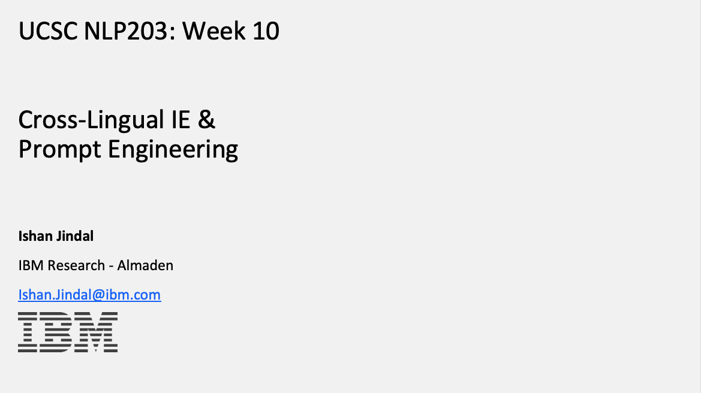

<h2>🎤 Invited Talks and Tutorials</h2>

<!-- FontAwesome -->
<link rel="stylesheet" href="https://cdnjs.cloudflare.com/ajax/libs/font-awesome/6.4.0/css/all.min.css">

---

  

    

      <b>TLC Seminar 2025@ Samsung R&D India, Delhi:</b>
      Agentic AI: Design Patterns and Protocols
    

    

      <b>Ishan Jindal</b>
    

    

      <i class="fa-solid fa-calendar-days"></i> 2025
    

  

  

    

      <b>Invited Talk 2025 @ Indo-Thai Workshop on AI Driven Innovations, IIT Gandhinagar:</b>
      Compact and Domain-specific LLMs with Infinite Context Length
    

    

      <b>Ishan Jindal</b>
    

    

      <a href=" https://events.iitgn.ac.in/2025/aidi/speakers.html" target="_blank">
        <i class="fa-solid fa-globe"></i> Event Page
      </a>
    

  

  
  

    

      <b>TLC Seminar 2024@ Samsung R&D India, Delhi:</b>
      Retrieval Augmented Generation
    

    

      <b>Ishan Jindal</b>
    

    

      <i class="fa-solid fa-calendar-days"></i> 2024
    

  

  
  

    

      <b>LREC-COLING 2024 Tutorial:</b> 
      <a href="https://lrec-coling-2024.org/tutorials/" target="_blank">
        Meaning Representations for Natural Languages: Design, Models, and Applications
      </a>
    

    

      Presented with: Julia Bonn, 
      <a href="https://jflanigan.github.io/">Jeffrey Flanigan</a>,  
      <a href="https://en.wikipedia.org/wiki/Jan_Haji%C4%8D">Jan Hajič</a>, 
      <a href="https://yunyaoli.github.io/">Yunyao Li</a>,
      <a href="https://www.cs.brandeis.edu/~xuen/">Nianwen Xue</a>
    

  

  

    

      <b>IJCAI 2023 Tutorial:</b> 
      <a href="https://ijcai-23.org/tutorials/" target="_blank">
        Meaning Representations for Natural Languages: Design, Models, and Applications
      </a>
    

    

      Presented with: Julia Bonn, 
      <a href="https://jflanigan.github.io/">Jeffrey Flanigan</a>,  
      <a href="https://timjogorman.github.io/">Tim O’Gorman</a>, 
      <a href="https://en.wikipedia.org/wiki/Jan_Haji%C4%8D">Jan Hajič</a>,
      <a href="https://yunyaoli.github.io/">Yunyao Li</a>,
      <a href="https://www.cs.brandeis.edu/~xuen/">Nianwen Xue</a>
    

  

  
 
    
    

      <b>EMNLP 2022 Tutorial:</b> 
      <a href="https://aclanthology.org/2022.emnlp-tutorials.1/" target="_blank">
        Meaning Representations for Natural Languages: Design, Models, and Applications
      </a>
    

    

      Presented with: <a href="https://jflanigan.github.io/">Jeffrey Flanigan</a>, 
      <a href="https://timjogorman.github.io/">Tim O’Gorman</a>, 
      <a href="https://yunyaoli.github.io/">Yunyao Li</a>, 
      <a href="https://www.colorado.edu/faculty/palmer-martha">Martha Palmer</a>, 
      <a href="https://www.cs.brandeis.edu/~xuen/">Nianwen Xue</a>
    

    

      <a href="https://underline.io/events/342/posters/12864/poster/67463-meaning-representations-for-natural-languages-design-models-and-applications" target="_blank">
        <i class="fa-solid fa-video"></i> Video
      </a>
      <a href="https://drive.google.com/file/d/1LS6q5VRsERD7nWX4vlQVmoz0ksfAWPL7/view?usp=sharing" target="_blank">
        <i class="fa-solid fa-file-powerpoint"></i> Slides
      </a>
      <a href="https://2022.emnlp.org/program/tutorials/" target="_blank">
        <i class="fa-solid fa-globe"></i> Tutorial Page
      </a>
    

  

  

    
    

      <b>NLP 203 @ UC Santa Cruz 2022:</b>
      <a href="https://www.meetup.com/Ann-Arbor-Detroit-NLPers-A2D-NLP/events/261618219/" target="_blank">
        Cross-lingual IE and Prompt Engineering
      </a>
    

    

      <b>Ishan Jindal</b>
    

    

      <a href="https://courses.engineering.ucsc.edu/courses/nlp203/Spring22/50" target="_blank">
        <i class="fa-solid fa-globe"></i> Event Page
      </a>
    

  

  

    

      <b>Invited Talk @ A2D NLP Meetup 2019:</b>
      <a href="https://www.meetup.com/Ann-Arbor-Detroit-NLPers-A2D-NLP/events/261618219/" target="_blank">
        An Effective Label Noise Model for DNN Text Classification
      </a>
    

    

      <b>Ishan Jindal</b>
    

    

      <a href="https://www.meetup.com/Ann-Arbor-Detroit-NLPers-A2D-NLP/events/261618219/" target="_blank">
        <i class="fa-solid fa-globe"></i> Event Page
      </a>
    

  

  

    

      <b>Invited Talk @ IEEE SEM Conference 2019:</b>
      <a href="https://events.vtools.ieee.org/m/191793" target="_blank">
        Classification of Noisy Multidimensional Images using Deep Learning
      </a>
    

    

      <b>Ishan Jindal</b>
    

    

      <a href="https://events.vtools.ieee.org/m/191793" target="_blank">
        <i class="fa-solid fa-globe"></i> Event Page
      </a>
    

